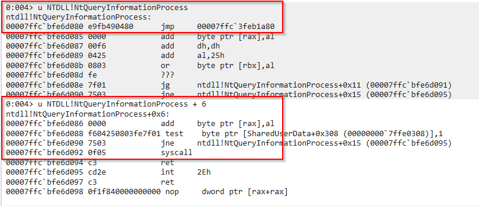
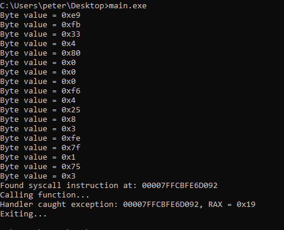

# CanaryGate

**CanaryGate** is a **Hells Gate** modification that uses "canary calls" to
reveal the syscall numbers of hooked NTDLL exports.

CanaryGate exploits a design flaw in certain EDRs (like BitDefender). The flaw
is that the EDRs re-use the existing `syscall` instruction within the NTDLL
stubs.

This means that supposing you make an innocuous call to a hooked function, the
hook logic will eventually result in the execution of the existing `syscall`
instruction.

Recall the way that syscalls are performed on Windows: the System Service Number
(SSN) is stored within the `rax` register before the `syscall` instruction is
executed.

By hooking the existing `syscall` instruction, we can capture the moment after
the EDR hook has executed. For the implementation of their hook to work, they
must have loaded the SSN into `rax` at that point in time.

Thus, the steps of CanaryGate can be summarized as follows:

1. Locate hooked function

2. "Look past" the hook and find the `syscall` instruction it will eventually
   execute

3. Hook the `syscall` instruction. For simplicity, the PoC uses a hardware
   breakpoint + VEH hook

4. Make a "canary call" -- call the doubly-hooked function with "normal"
   (non-malicious) arguments

5. When your hook is hit, collect the SSN number from RAX

6. Build VX table using SSNs and perform **Hells Gate** as normal

# PoC Example

The PoC code `main.c` provides a sample implementation of CanaryGate. We target
the `NtQueryInformationProcess` function (this function is hooked by
BitDefender) and hook the `syscall` instruction.

We then perform a canary call to our doubly-hooked NTDLL function, where we
extract the syscall number of `NtQueryInformationProcess` by reading the value
from the `rax` register.

Notice that in the below image first few bytes start with `0xE9` -- a
non-conditional jump opcode -- this is the EDR hook. We skip past those bytes
and identify the re-used `syscall` instruction for our hook.

